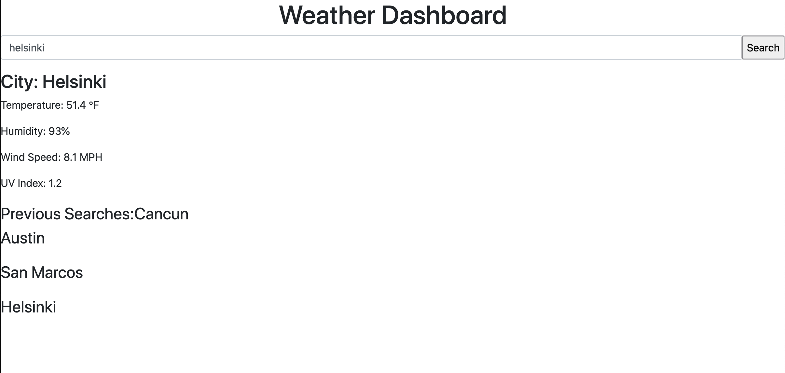

# Weather Dashboard

The use of API's is implemented here in order to fetch weather information from any city in the known universe.

It is very basic and stores the most recent city searched in local storage upon refresh.

## Links
to repo: https://github.com/julianriverajr/Weather-Dashboard

to github-pages: https://julianriverajr.github.io/Weather-Dashboard/

## Screenshot

